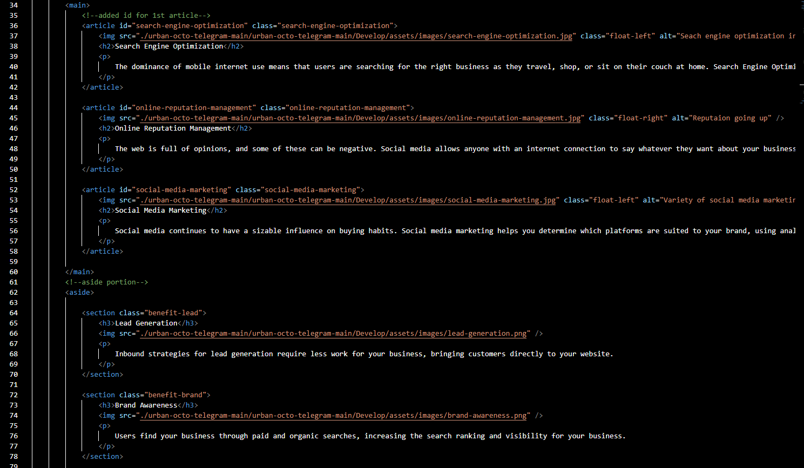

# Horiseon Marketing Accessibility Challenge

## This challenge was based around a starter code I had to make accessible. Using class recources I managed to rewrite the given html and css in order to deploy a live website that is accessible and formatted properly.

## Usage includes: SEO shortcut, Online Reputation Management shortcut, and Social Media Marketing shorcut.

## Examples include: Given code was a div soup so I used different elements to make it easier to read. 

